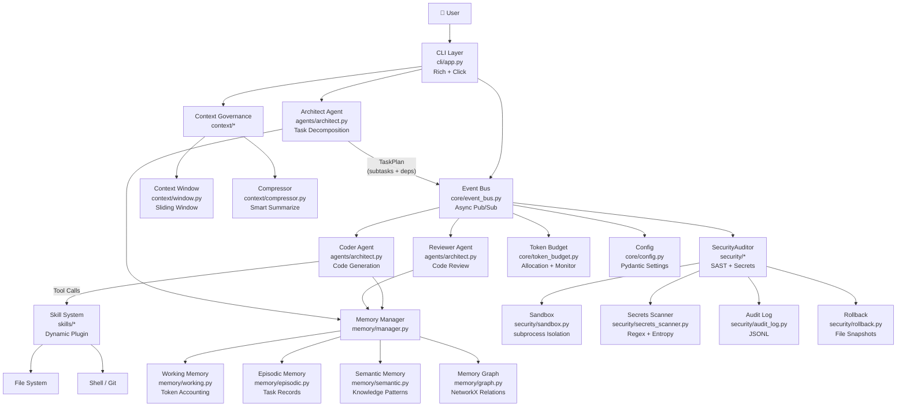
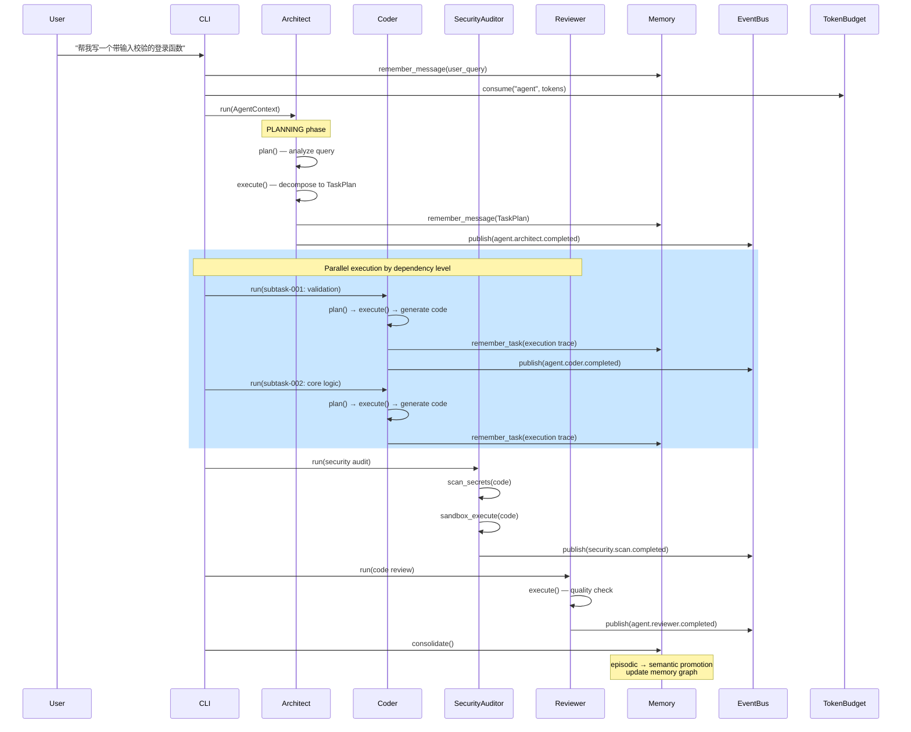
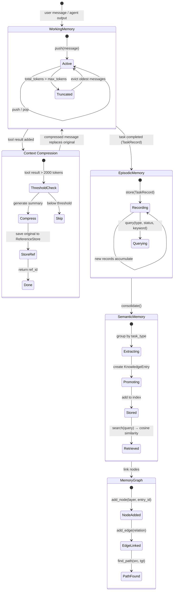

# KiraCode 架构设计文档

## 1. 系统架构图

## 2. Agent 协作时序图

## 3. 记忆系统状态图

## 4. 模块职责

| 模块 | 核心文件 | 职责 |
|------|---------|------|
| **core/** | config.py, event_bus.py, token_budget.py | 配置管理、异步事件总线、Token 预算分配与监控 |
| **agents/** | base.py, architect.py | Agent 抽象基类 + 状态机、Architect 任务分解、Coder 代码生成、Reviewer 审查 |
| **memory/** | working.py, episodic.py, semantic.py, graph.py, manager.py | 三层记忆（工作/情景/语义）+ NetworkX 图谱 + 统一管理器 |
| **context/** | window.py, compressor.py | 上下文窗口滑动淘汰、智能压缩（JSON/日志/文本策略）+ 引用追踪 |
| **security/** | sandbox.py, secrets_scanner.py, audit_log.py, rollback.py | 沙箱隔离执行、密钥扫描（正则+熵）、JSONL 审计、文件快照回滚 |
| **skills/** | registry.py, loader.py, router.py, builtin/ | 注册中心、动态加载、语义路由、4 个内置 Skill |
| **cli/** | app.py | Rich 交互式 REPL + 单次查询模式 |
| **utils/** | token_counter.py | 轻量 Token 计数器 |

## 5. 架构决策记录（ADR）

### ADR-1: 为什么用事件驱动而不是直接函数调用？

**背景**：多个 Agent（Architect / Coder / Reviewer / SecurityAuditor）需要协作完成任务。

**决策**：使用异步 EventBus（publish/subscribe）而非直接函数调用。

**理由**：
1. **解耦**：Agent 之间不需要知道彼此的存在，只需发布和订阅事件类型
2. **可扩展**：新增 Agent 只需订阅相关事件，不修改现有代码
3. **可观测**：EventBus 记录所有事件历史，便于调试和审计
4. **异步并行**：多个 handler 可以并发处理同一事件

**权衡**：增加了一层间接性，调试时需要追踪事件流。通过事件历史和结构化日志缓解。

### ADR-2: 为什么记忆分三层而不是统一向量库？

**背景**：Agent 需要记住当前上下文、历史任务经验、以及抽象知识模式。

**决策**：三层分离 — Working（会话）/ Episodic（任务）/ Semantic（知识）+ MemoryGraph 关联。

**理由**：
1. **认知科学依据**：人类记忆分为工作记忆（短期）、情景记忆（事件）、语义记忆（知识），三层架构模拟这一结构
2. **生命周期不同**：Working Memory 会话结束即释放；Episodic 持久化为任务轨迹；Semantic 长期保留
3. **检索策略不同**：Working 按时间顺序；Episodic 按类型/状态过滤；Semantic 按向量相似度
4. **consolidate 机制**：类似人类睡眠记忆巩固，将成功的 Episodic 记录提炼为 Semantic 知识

**权衡**：增加了系统复杂度。通过 MemoryManager 统一入口简化使用。

### ADR-3: 为什么 SecurityAuditor 是独立 Agent 而不是后置规则？

**背景**：代码安全检查可以在生成后作为规则引擎执行，也可以作为独立 Agent 参与规划。

**决策**：设计为独立 Agent，参与 Architect 的任务规划流程。

**理由**：
1. **主动性**：Agent 可以在规划阶段就识别安全风险（如"用 Flask 写上传接口" → 检索相关 CVE），而非事后补救
2. **上下文感知**：Agent 了解整个 TaskPlan 的上下文，可以针对特定场景定制检查规则
3. **决策能力**：Agent 可以决定是否阻断流程、降级处理、或要求人工审查
4. **可组合**：安全审计可以作为子任务插入到 TaskPlan 的任意位置

**权衡**：增加了 Agent 调度开销。通过 Mock LLM 和并行执行最小化延迟。
